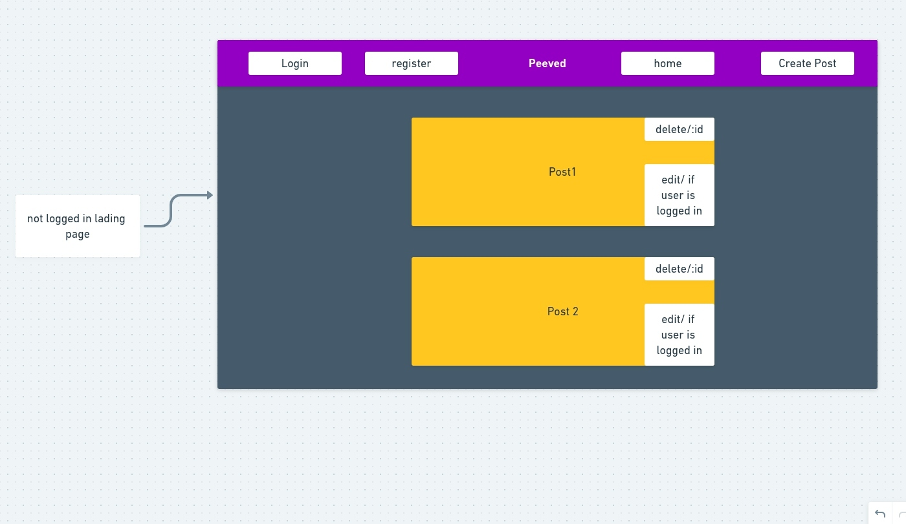
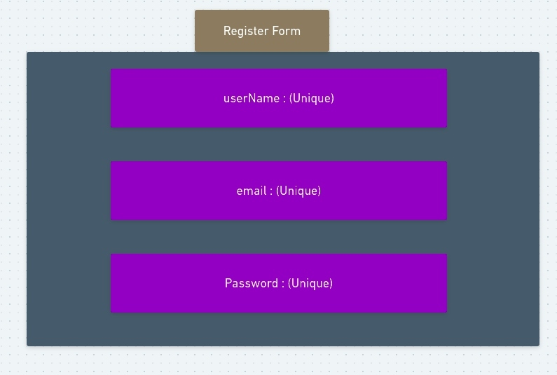
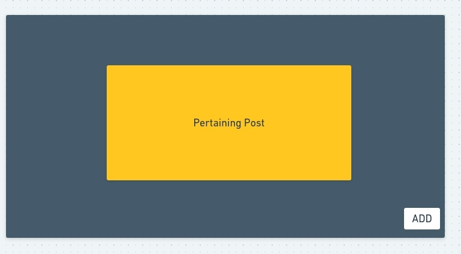

# Peeved
A top pet peeves blog application

## Members
- Rick Hertel   
- John Tran
- Abdi Osman

## Group Expectations


## MVP Goals

- Create MERN application and deploy via Heroku and Netlify
- Application will have full front-end and back-end CRUD functionality
- Application will have collections for both User and Posts
- Application will have JWT authorization, 
- Render application in browser
- The Peeved repo has a README.md that documents the project in detail

## Post-MVP Goals
- Allow users to make comments on any post if they are logged in
- Add Likes
- Hamburger menu
- Add dropdown/pop-up login on hover/click etc.
- Additional styling, animations
- Posts Search

## Database Schemas
```
userSchema
  {
    username: { type: String, required: true, unique: true },
    email: { type: String, required: true },
    password_digest: { type: String, required: true }
  }

postSchema
  {
    title: { type: String, required: true },
    content: { type: String, required: true },
    userId: { type: Schema.Types.ObjectId, ref: "User" }
  }
```

## MERN Chart


## Wireframes







## Component Hierarchy


## Timeframes


| Component | Priority | Estimated Time | Actual Time| 
| --- | :---: |  :---: | :---: | 
| Planning | H | 3hrs| 3hrs | 
| MERN chart/Design | H | 2.5hrs| 2.5hrs |
| Backend setup/ DB connect | H | 3hrs| 0hrs |
| models/schemas | H | 3hrs| 0hrs |
| Link seed data | H | 3hrs| 0hrs |
| Server setup | H | 3hrs| 0hrs |
| User controller | H | 3hrs| 0hrs |
| Post controller | H | 3hrs| 0hrs |
| Routes | H | 3hrs| 0hrs |
| Implement JWT auth| H | 3hrs| 0hrs |
| Add header-config/ Test | H | 3hrs| 0hrs |
| Test all CRUD | H | 3hrs| 0hrs |
| React structure set-up | H | 3hrs| 0hrs |
| Screen Layout | H | 3hrs| 0hrs |
| Axios | H | 3hrs| 0hrs |
| Set-up routes | H | 3hrs| 0hrs |
| User registration form | H | 3hrs| 0hrs |
| New post form | H | 3hrs| 0hrs |
| Nav/ login form | H | 3hrs| 0hrs |
| Form handeling | H | 3hrs| 0hrs |
| Improve API calls | H | 3hrs| 0hrs |
| Render Posts | H | 3hrs| 0hrs |
| Add user update | H | 3hrs| 0hrs |
| Post update/delete | H | 3hrs| 0hrs |
| Debug| H | 3hrs| 0hrs |
| Add common stlying | H | 3hrs| 0hrs |
| Style each component | H | 3hrs| 0hrs |
| Nav bar Styling | H | 3hrs| 0hrs |
| Responsivness | H | 3hrs| 0hrs |
| Hamburger menu | H | 3hrs| 0hrs |
| Animations | H | 3hrs| 0hrs |
| Like button | H | 3hrs| 0hrs |
| Dropdown for Login | H | 3hrs| 0hrs |
| Bottom section/footer | H | 3hrs| 0hrs |
| Add commenting | H | 3hrs| 0hrs |
| Posts Search | H | 3hrs| 0hrs |
| Total | H | 107.5hrs| 0hrs | 


## SWOT Analysis

_<strong>Rick</strong>_
- S: Back-end, front-end structure, routing
- W: Front-end components rendering, handling
- O: To learn from my teammates based on their strengths
- T: Not sticking to group expectations/team communication

_<strong>John_</strong>
- S: I am confident in my Front-end knowledge
- W: Authorization component of the app may be a struggle for me

- O: To learn and improve my weakness in some of my coding skill
- T: Time management and not able to meet expectation of others

_<strong>Abdi</strong>_
- S: I think getting the database setup will go smoothly as i am confident in that.
- W: I feel as though i will have trouble with connecting backend to the front
- O:I have an opportunity to really dive in styling and color schemes.
- T: A big threat for me is time management because i am not very good with that
